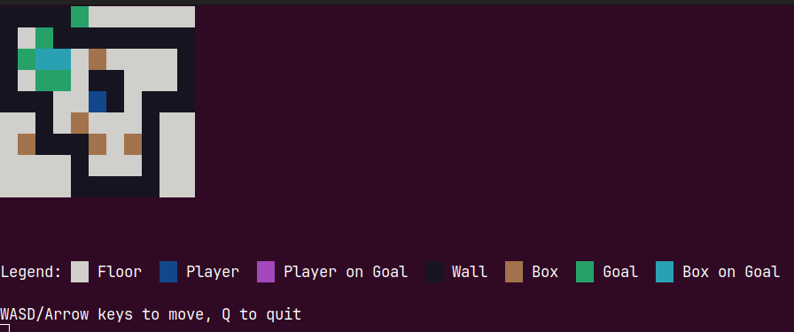

+++
date = '2026-03-03'
title = 'Puzzle'
tags = ['reverse engineering', 'hard']
+++

Category: Reverse engineering

Difficulty: Hard (459 points)

Author: Alex Van Mechelen

## Description

Push all the boxes onto a goal. Simple enough, ...right?

## Challenge files

[puzzle](files/puzzle), [Dockerfile](files/Dockerfile)

## Observations

This is a classic Sokoban puzzle, with the exception that this puzzle is unsolvable in the default state
since there is a box enclosed by walls. (Note: there was apparently a way to open a door in the wall, 
but I didn't find that so this solution does not use that.)



After searching to the binary a bit we find this function that is called when the win state is reached,
it decrypts the flag using a double XOR from the output of `FUN_0040185b` for `local_50` and `local_18`.
```c
void FUN_0040188f(undefined8 param_1)
  undefined8 local_50;
  byte local_48 [48];
  undefined8 local_18;
  byte local_f;
  byte local_e;
  byte local_d;
  int local_c;
  
  local_50 = param_1;
  local_18 = FUN_004017d6();
  local_48[0] = 0x60;
  local_48[1] = 0x6e;
  local_48[2] = 0x1c;
  ...
  local_48[0x27] = 0x90;
  for (local_c = 0; local_c < 0x28; local_c = local_c + 1) {
    local_d = FUN_0040185b(&local_50);
    local_e = FUN_0040185b(&local_18);
    local_f = local_48[local_c] ^ local_d ^ local_e;
    putchar((uint)local_f);
  }
  putchar(10);
  return;
}
```

`FUN_004017d6` is a function that hashes the current map state. The flag decoding function uses this hash
of the initial map (`param_1` and `local_50`), and of the final map (`local_18`).

```c
long FUN_004017d6(void){
  byte local_19;
  int local_18;
  int local_14;
  long local_10;
  
  local_10 = 0;
  for (local_14 = 0; local_14 < 9; local_14 = local_14 + 1) {
    for (local_18 = 0; local_18 < 0xb; local_18 = local_18 + 1) {
      local_19 = s_####._00404060[(long)local_18 + (long)local_14 * 0xe];
      if ((local_19 == 0x40) || (local_19 == 0x2b)) {
        local_19 = 0x20;
      }
      local_10 = (ulong)local_19 + local_10 * 0x1f;
    }
  }
  return local_10;
}
```

Lastly the XOR uses the output of this function, which edit the input value.
```c
ulong FUN_0040185b(ulong *param_1 ){
  *param_1 = (ulong)((int)*param_1 * 0x41c64e6d + 0x3039U & 0x7fffffff);
  return *param_1;
}
```

## Solution

First I tried to reconstruct the map in the winning state, but this failed (I now know this is because the winning state removes a wall).

So I turned my attention to `FUN_0040185b`, and I noticed the computation casts everything to an int and takes 31 bytes, 
which we could use to brute force the initial `local_18` state using the known prefix of `CSC{` (the flag format).
We can compute the initial `local_e` state by reversing the XORs, which already gives us 8 known bytes, so there are only
23 unknown bytes, and since this is a relatively cheap computation, 8.388.608 options is easily computable.
```c
((int)*param_1 * 0x41c64e6d + 0x3039U & 0x7fffffff)
```

## Solution script
```c
#include <stdio.h>

// #: wall
// .: goal
// ' ': floor
// $: box
// *: box on goal
// #: player
// +: player on goal
const char *map =
    "####.      \0\0\0" //0
    "# .########\0\0\0" //1
    "#.** $    #\0\0\0" //2
    "# .. ##   #\0\0\0" //3
    "###  @# ###\0\0\0" //4
    "  # $   #  \0\0\0"
    " $###$ $#  \0\0\0"
    "    #   #  \0\0\0"
    "    #####  \0\0\0"
    "\0\0\0\0\0\0\0\0\0\0\0\0\0"
    "\0\0\0\0\0\0\0\0\0\0\0\0\0";

unsigned long FUN_0040185b(unsigned long *param_1) {
    *param_1 = (unsigned long)((int)*param_1 * 0x41c64e6d + 0x3039U & 0x7fffffff);
    return *param_1;
}

// Could also be hard coded to 0xd07b6ca1b52da5e1 which can be recovered from the binary,
// but I already ported this for trying to hash (what I thought was) the finished map.
long hash_map(void) {
    unsigned char local_19;
    int local_18;
    int local_14;
    long local_10;

    local_10 = 0;
    for (local_14 = 0; local_14 < 9; local_14 = local_14 + 1) {
        for (local_18 = 0; local_18 < 0xb; local_18 = local_18 + 1) {
            local_19 = map[(long)local_18 + (long)local_14 * 0xe];
            if ((local_19 == '@') || (local_19 == '+')) {
                local_19 = ' ';
            }
            local_10 = (unsigned long)local_19 + local_10 * 0x1f;
        }
    }
    return local_10;
}

void print_flag(long final_map_hash) {
    long local_50;
    unsigned char local_48[48]; // Byte type
    long local_18;

    // Byte types
    unsigned char local_f;
    unsigned char local_e;
    unsigned char local_d;

    int local_c;

    local_50 = hash_map();
    local_18 = final_map_hash;
    local_48[0] = 0x60;
    local_48[1] = 0x6e;
    local_48[2] = 0x1c;
    local_48[3] = 0x6e;
    local_48[4] = 0x76;
    local_48[5] = 0x91;
    local_48[6] = 0x94;
    local_48[7] = 0xd4;
    local_48[8] = 0x5c;
    local_48[9] = 0x9d;
    local_48[10] = 0x9c;
    local_48[0xb] = 0x94;
    local_48[0xc] = 0x40;
    local_48[0xd] = 0x3c;
    local_48[0xe] = 0x58;
    local_48[0xf] = 0x6d;
    local_48[0x10] = 0x4f;
    local_48[0x11] = 0x6e;
    local_48[0x12] = 0xe0;
    local_48[0x13] = 0xd2;
    local_48[0x14] = 0x62;
    local_48[0x15] = 0x53;
    local_48[0x16] = 0x82;
    local_48[0x17] = 0x32;
    local_48[0x18] = 0xae;
    local_48[0x19] = 200;
    local_48[0x1a] = 0xf0;
    local_48[0x1b] = 0x21;
    local_48[0x1c] = 0xbd;
    local_48[0x1d] = 0xea;
    local_48[0x1e] = 0x93;
    local_48[0x1f] = 0xd5;
    local_48[0x20] = 0x50;
    local_48[0x21] = 0xaf;
    local_48[0x22] = 0x80;
    local_48[0x23] = 0xa5;
    local_48[0x24] = 0x1d;
    local_48[0x25] = 0;
    local_48[0x26] = 0x86;
    local_48[0x27] = 0x90;

    // Increment the local_d state 4 times 
    for (int i = 0; i < 4; i++) {
        FUN_0040185b(&local_50);
    }
    // Start from the letter after CSC{
    printf("Flag: CSC{");
    for (local_c = 4; local_c < 0x28; local_c = local_c + 1){
        local_d = FUN_0040185b(&local_50);
        local_e = FUN_0040185b(&local_18);
        // printf("local_d: %x, local_e: %x\n", local_d, local_e);
        local_f = local_48[local_c] ^ local_d ^ local_e;
        putchar((unsigned int)local_f);
    }
    putchar(10);
    return;
}

int main(void) {
    // Find the first 4 expected local_e values based on the CSC{ prefix
    long map_hashed = hash_map();
    long local_e_expected[4];
    unsigned char first_chars[4] = {'C', 'S', 'C', '{'};
    long secret_first[4] = {0x60, 0x6e, 0x1c, 0x6e};
    for (int i = 0; i < 4; i++) {
        unsigned char local_d = FUN_0040185b(&map_hashed);
        local_e_expected[i] = first_chars[i] ^ secret_first[i] ^ local_d;
    }
    
    // Try to find the state that produces the expected local_e values for the first 4 characters of the flag.
    unsigned long state;
    for (unsigned int k = 0; k < (1u << 23); k++) {
        state = (k << 8) | local_e_expected[0];
        if ((unsigned char) FUN_0040185b(&state) != local_e_expected[1]) continue;
        if ((unsigned char) FUN_0040185b(&state) != local_e_expected[2]) continue;
        if ((unsigned char) FUN_0040185b(&state) != local_e_expected[3]) continue;
        printf("Found matching initial state.\n");
        break;
    }

    print_flag(state);
    return 0;
}
```

Flag: `CSC{E4sy_p3asy_pls_g1ve_me_4noTh3R_0ne!}`