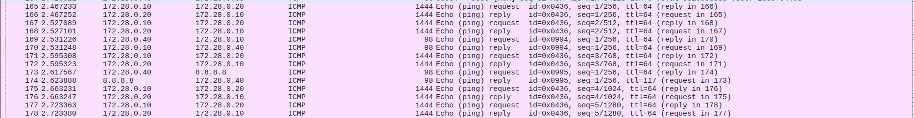
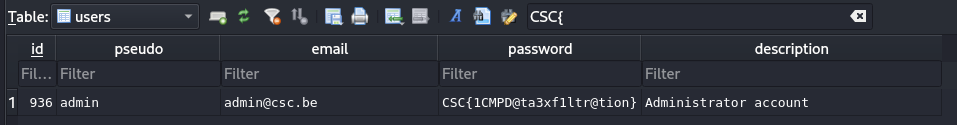

+++
date = '2026-03-03'
title = 'The Great Escape Plan'
tags = ['forensics', 'hard']
+++

Category: Forensics

Difficulty: Hard (456 points)

Author: Quentin Stevens

## Description

Totally normal office traffic. Definitely not a leak.

## Challenge files

[capture.pcap](files/capture.pcap)

## Solution

Opening the pcap file in WireShark, the first thing I noticed is that there were a lot of very large ping packets.
The data in these ping packets was in base64 format.



Since there was thousands of large ping packets I decided to extract all the data in the files and append them after each other in a file using this small script.
```py
import base64
import re
from scapy.all import rdpcap, IP, ICMP, Raw

pkts = rdpcap("capture.pcap")
parts = {}

for p in pkts:
    if IP in p and ICMP in p and p[ICMP].type == 8 and Raw in p:
        if p[IP].src != "172.28.0.10" or p[IP].dst != "172.28.0.20":
            continue

        # Extract the payload data
        payload = bytes(p[Raw].load)
        s = payload.decode("ascii", errors="ignore").strip()
        
        # Extract seq data
        m = re.match(r"^\s*(\d+)\s*:\s*([A-Za-z0-9+/=]+)\s*$", s)
        if not m:
            # Ignore misformed data
            continue
        
        seq = int(m.group(1))
        b64 = m.group(2).encode("ascii")
        parts.setdefault(seq, b64)

# Reassemble in seq order
blob = bytearray()
for seq in sorted(parts):
    b64 = parts[seq]
    blob += base64.b64decode(b64, validate=False)

open("out.bin", "wb").write(blob)
```

When checking the type of the file we can see we got a video!
```
$ file out.bin 
out.bin: ISO Media, MP4 Base Media v1 [ISO 14496-12:2003]
```

Playing the video we see that it is a video of a lot of QR codes. After scanning one manually it also became clear that this data to was base64 encoded.
So, same thing again, I extracted all the video frames using FFMPEG, then scanned all the QR codes and wrote it to a file.
```
$ ffmpeg -i out.bin frames/frame_%04d.png
```

```py
import base64
import zxingcpp
import cv2

frame_count = 144
blob = bytearray()

for i in range(1, frame_count + 1):
    frame_file = f"frames/frame_{i:04d}.png"
    
    img = cv2.imread(frame_file)
    results = zxingcpp.read_barcodes(img)
    if not results:
        raise ValueError(f"No QR found in {frame_file}")

    text = None
    for r in results:
        if r.text:
            text = r.text
            break
    if not text:
        raise ValueError(f"QR detected but no text decoded in {frame_file}")

    print(frame_file, len(text))
    blob += base64.b64decode(text)

open("out.bin", "wb").write(blob)
```

Then after checking the type of this file, we see we got a password protected zip.

```
$ file data.zip 
data.zip: Zip archive data, at least v2.0 to extract, compression method=deflate
$ 7z l -slt data.zip 

7-Zip 23.01 (x64) : Copyright (c) 1999-2023 Igor Pavlov : 2023-06-20
 64-bit locale=en_US.UTF-8 Threads:12 OPEN_MAX:1024

Scanning the drive for archives:
1 file, 146623 bytes (144 KiB)

Listing archive: data.zip

--
Path = data.zip
Type = zip
Physical Size = 146623

----------
Path = users.db
Folder = -
Size = 352256
Packed Size = 146441
Modified = 2026-01-30 22:07:32
Created = 
Accessed = 
Attributes =  -rw-r--r--
Encrypted = +
Comment = 
CRC = F12922C5
Method = ZipCrypto Deflate
Characteristics = UT:MA:1 ux : Encrypt Descriptor
Host OS = Unix
Version = 20
Volume Index = 0
Offset = 0
```

Since the archive used `ZipCrypto`, which is quite old and insecure, I decided to see if I could crack it using John the Ripper and the rockyou word list.
```
$ zip2john data.zip > hash.txt
ver 2.0 efh 5455 efh 7875 data.zip/users.db PKZIP Encr: TS_chk, cmplen=146441, decmplen=352256, crc=F12922C5 ts=B0F0 cs=b0f0 type=8

$ john --wordlist=/usr/share/wordlists/rockyou.txt hash.txt
Using default input encoding: UTF-8
Loaded 1 password hash (PKZIP [32/64])
Will run 12 OpenMP threads
Press 'q' or Ctrl-C to abort, almost any other key for status
jamieleemonroe   (data.zip/users.db)     
1g 0:00:00:00 DONE (2026-03-03 15:50) 2.702g/s 19461Kp/s 19461Kc/s 19461KC/s jan3108..jake010604
Use the "--show" option to display all of the cracked passwords reliably
Session completed. 
```
This succeeded, and so we find the password `jamieleemonroe`.

Now we can extract the database file, and when opening this and searching for `CSC{` we finally find the flag!
